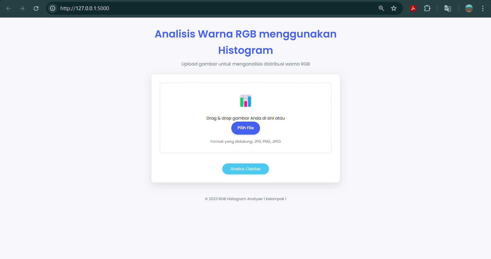
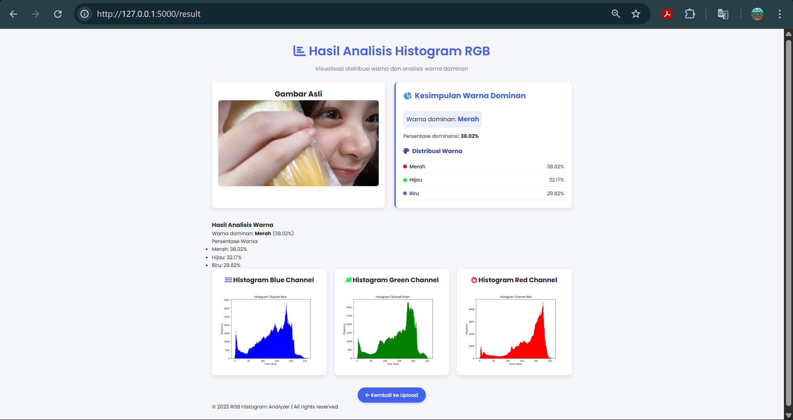

# Histogram Citra (Image Histogram Analysis)

## 📌 Deskripsi Proyek

Proyek ini adalah aplikasi berbasis web yang menggunakan **Flask** dan **OpenCV** untuk menganalisis histogram citra. Pengguna bisa mengunggah gambar, melihat histogram RGB-nya, serta mendapatkan informasi warna dominan dari gambar tersebut. Tidak terdapat fitur peningkatan kualitas gambar.

## 🛠 Teknologi yang Digunakan

- **Python 3**
- **Flask** (Backend)
- **OpenCV** (Pemrosesan citra)
- **HTML dan CSS** (Frontend)
- **Bootstrap** (Styling UI)

## 📂 Struktur Folder

```
/ilkom-23-citra-kelompok-1
│── static/              # Folder untuk file statis (hasil gambar)
│── templates/           # Folder untuk file HTML
│── uploads/             # Folder penyimpanan gambar yang diunggah
│── venv/                # Virtual environment (jangan di-push ke Git)
│── .gitignore           # File untuk mengabaikan file tertentu dalam Git
│── app.py               # Main backend Flask app
│── README.md            # Dokumentasi proyek ini
│── requirements.txt     # Daftar dependensi proyek
```

## 🔧 Cara Instalasi dan Menjalankan

### 1️⃣ **Clone Repo & Masuk ke Direktori**

```bash
git clone https://github.com/kurapika12/ilkom-23-citra-kelompok-1.git
cd ilkom-23-citra-kelompok-1
```

### 2️⃣ **Buat dan Aktifkan Virtual Environment (opsional)**

#### 💻 **Windows** (Command Prompt / PowerShell)

```bash
python -m venv venv
venv\Scripts\activate
```

#### 🍏 **Mac/Linux** (Terminal)

```bash
python3 -m venv venv
source venv/bin/activate
```

### 3️⃣ **Install Dependencies**

```bash
pip install -r requirements.txt
```

### 4️⃣ **Jalankan Aplikasi**

```bash
python app.py
```

Aplikasi akan berjalan di `http://127.0.0.1:5000/`

## Tampilan Aplikasi

**CONTOH HALAMAN UTAMA**

**CONTOH HALAMAN HASIL**



## ⚙️ Fitur Utama

✅ **Upload Gambar** - Pengguna bisa mengunggah gambar berformat JPG/PNG.<br>
✅ **Tampilan Histogram** - Histogram gambar asli bisa ditampilkan.<br>
✅ **Analisis Warna Dominan** - Menampilkan warna dominan dan persentasenya.<br>
✅ **Perbandingan hasil histogram** - Menampilkan hasil grafik histogram

## 📸 Contoh Penggunaan

1. **Upload gambar** Pada halaman utama, klik area bertuliskan "Drag & drop gambar Anda di sini atau Pilih File".
   Pilih gambar dengan format JPG, PNG, atau JPEG dari perangkat Anda. Setelah gambar dipilih, nama file akan muncul di bawah area upload.
2. **Analisis Gambar** Klik tombol "Analisis Gambar" untuk mengunggah gambar dan memulai proses analisis warna RGB menggunakan histogram.
3. **Lihat Gambar Asli dan Hasil Analisis** Setelah gambar dianalisis, Anda akan diarahkan ke halaman hasil. Di sana akan ditampilkan : Gambar asli yang Anda unggah Informasi warna dominan (merah, hijau, atau biru) beserta persentasenya
4. **Kembali ke Halaman Upload** Setelah melihat hasil analisis, Anda bisa kembali ke halaman awal dengan mengklik tombol "Kembali ke Upload".

## 💡 Catatan

- Pastikan gambar dalam format **JPG atau PNG** sebelum diunggah.

## ✨ Kontributor

- **M. Aslam Hidayat** - [GitHub Profile](https://github.com/kurapika12)
- **Abdul Mu'iz Azizul Raeba** - [Github Profile](https://github.com/Coklatssss)
- **Wa Ode Zahra Ramadani** - [Github Profile](https://github.com/WaOdeZahraRamadani0410)
- **Reynaldo Dwi Septano Baru** - [Github Profile](https://github.com/reyynald)
- **Zacky Fiqran Kasmada** - [Github Profile](https://github.com/Zackyfiqran038)
- **Fitri Nur Ramadhani** - [Github Profile](https://github.com/Fitrinurramadhani79)
- **Siti Nuraisyah Sea** - [Github Profile](https://github.com/acousticname00)

---

🚀 Selamat mencoba! Jika ada pertanyaan, silakan ajukan di Issues atau Pull Request. 😃